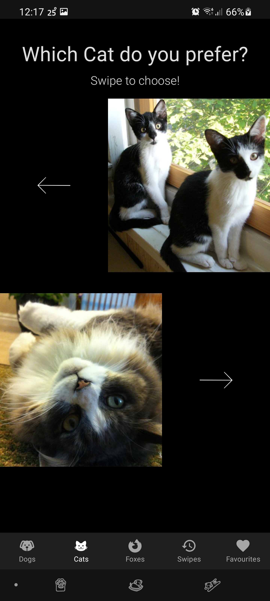
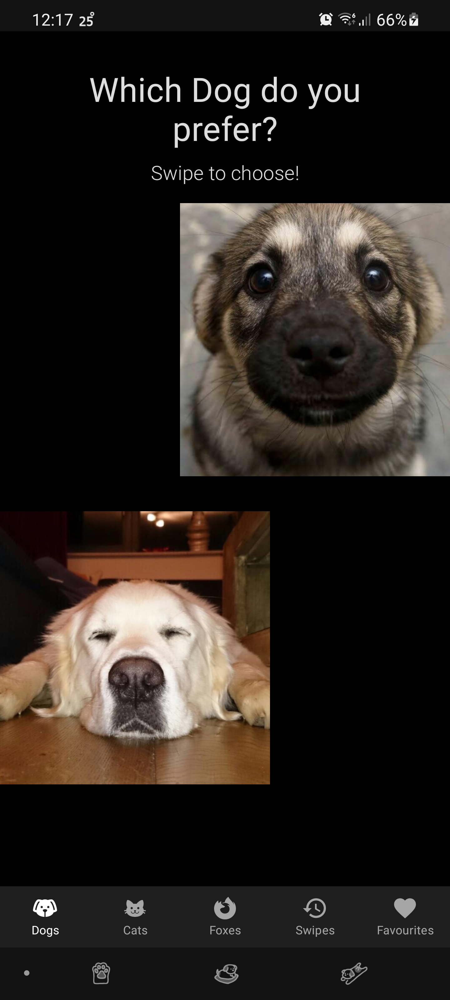
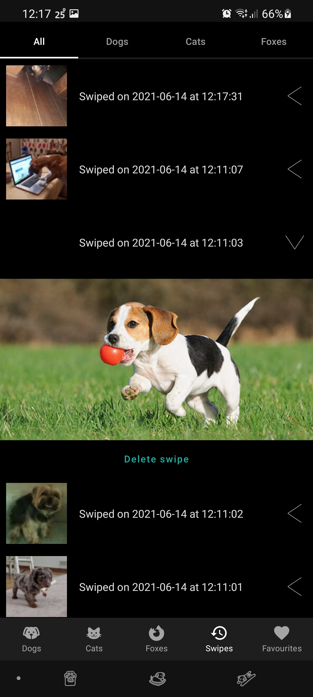
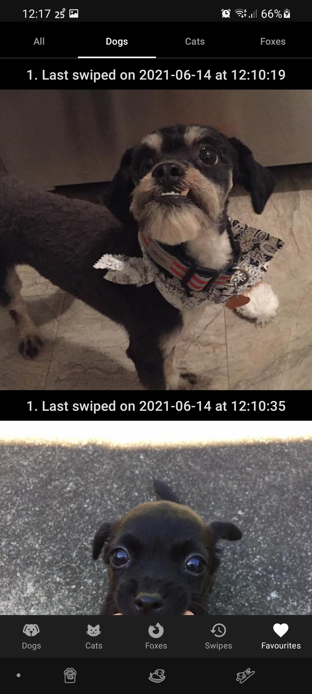

# AnimalCompare - a simple app to find your favourite picture of cats, dogs and foxes!

This is a relatively simple app on the surface, that allows users to swipe through pictures of dogs, cats and foxes, and effectively find their favourites. The pictures are put up side by side and the user has to swipe to choose an animal. They also have an option to review their past swipes and delete any they made by accident, or no longer agree with. On top of this they can see their ranked photos and have it broken down by specific animal.

The purpose of the app is more so to demonstrate a strong cohesion of the different architecture components, as well as the new Jetpack Compose. The app was designed from the ground up to utilise the features these libraries provide. It also has a dark and a light theme, however I personally prefer dark themes! Room was used as the main source of truth in the app, storing all the different animals, swipes. Some complex queries were utilised, as well as a demonstration of how effectively objects can be pulled from it and used, making development a lot cleaner and overall more effective.

Retrofit was also utilised, alongside kotlinx serialization, this proved very effective to cleanly work with the json data returned by the different APIs used within. A full list of the libraries used are listed at the bottom.

## How to run the app

Download the latest Arctic Fox version, Beta 3 at the time of writing this, of android studio. I have provided an APK but I cannot guarantee that will work as well as building it directly.

## Screenshots

 

 

## Post-mortem

The app went relatively well I would say, I achieved most of the goals I set out to with the app. The UI was a interesting to begin with, as I was learning Jetpack Compose as I went, however it started to make sense relatively quickly and became a useful asset. I have only started to scratch the surface, especially when it comes to animation, so I would love to do more in this regard, however within the scope of the app it doesn't lead to much more being necessary. Plus I only had to manually implement one feature, that being support for Pager Source in a LazyList with a custom key. But given the library is still in alpha, I am sure that is to come.

When it came to structuring the internal data I think there is some *room* for improvement, especially when it came to setting up the relations, but I think that it's clean enough for the use cases outlined. There aren't many hard constraints, but they are enforced largely in other parts of the app, so I am not too concerned about it.

I do prefer using navigation as a basis of an app, and sticking to the one activity, multiple fragments design philosophy it loosely imposes, especially with compose, they tie together extremely well. 

I am not a fan of how the swipe screen turned out, I think that there should be a cleaner way of showing the comparisons, especially on different sized screens/aspect ratios/orientations, but I am not the best designer. I think this was a clean enough middle ground, with the landscape orientation not fairing the best, but the animation ties the swipe screen together so I like it enough as it is!

The main issue the app has is the inconsistent image size. Working with 3 different APIs where the data isn't very well sanitised is not ideal. Some of the images could be a couple kilobytes, and some could be 10s of megabytes, leading to an inconsisten performance in the preloading. If it was a professional backend infrastructure there would be standardised image sizes and compression done, leading to less work on the network requests, but I worked with what I had. Plus it is still beneficial to treat all requests as they might take forever, with certain network conditions users can have.

## Testing

Testing is one of my weaker areas for sure, but the advantage of the new modern architecture components is that they all have their own way of being tested. I have only done Dao testing with the Room database as I am still researching effective testing in compose etc and how to properly access the necessary properties to cleanly test, without reflection etc.

## Future improvements

- Add a proper release variant also missed due to not being necessary
- Add analytics, they were missed out for now as they felt outside the scope of the app
- Potentially add more colour, and also add the number of votes each animal has, maybe with more title content
- Restructure some of the navigation, to support future animals
- Simplify the animal definitions to a single type, although this poses different issues in terms of what part of the app needs what information, it is generally better to not provide too much info so this is a preference one I think
- Show the loser of each swipe
- Let users bookmark images so that they can have their own "favourites" list of images that haven't shown up enough to make it into the favourites list

## Libraries used

Lifecycle Viewmodels - https://developer.android.com/jetpack/androidx/releases/lifecycle

Jetpack Compose - https://developer.android.com/jetpack/androidx/releases/compose

Navigation - https://developer.android.com/jetpack/androidx/releases/navigation

Paging - https://developer.android.com/jetpack/androidx/releases/paging

Room - https://developer.android.com/jetpack/androidx/releases/room

Kotlinx Coroutines - https://github.com/Kotlin/kotlinx.coroutines

Kotlinx Serialization - https://github.com/Kotlin/kotlinx.serialization

Coil - https://github.com/coil-kt/coil

Coil for Jetpack Compose - https://google.github.io/accompanist/coil/

Pager - https://google.github.io/accompanist/pager

Hilt/Dagger - https://github.com/google/dagger

OkHTTP - https://github.com/square/okhttp

Retrofit - https://github.com/square/retrofit
