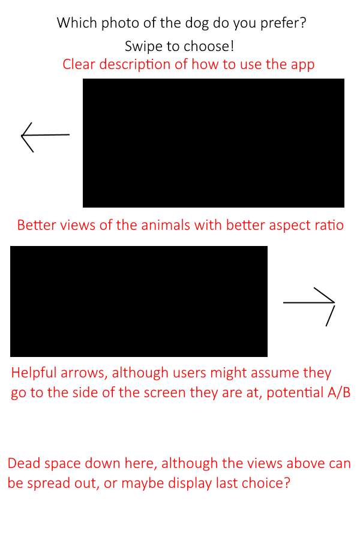

# Animal compare design goals
The aim of Animal Compare is to produce an app that lets the user find their favourite dog/cat/fox photos from a random assortment. The user should also be able to view the selections they have made and correct any that were made in error. They should also be prompted with the ones they have already swiped on from time to time, this way each photo can accumulate points, allowing a ranking to form. The photos should be selected in a non-determenistic manner, so that the user doesn't predict a pattern, leading to them to feel the app has run out of content.

Two modes of comparison have been proposed, the first would pit animals of the same type against each other, with some method of switching to a different animal, the other would be to show 1 of each type at the same time and let them pick. They both achieve different aims of the app, and will be explored further.

## Comparing animals of the same type
When it comes to comparing animals of the same type we are then making a more fair comparison. This allows the user to make more fine grained choices, rather than a generic preference of the type of animal, but it does have drawbacks. To market the app to as many users as possible it would be necessary to let them choose the animal they are comparing, however if they prefer multiple of the selected set then they might want to compare both at different or even the same time. To alleviate this problem a method of switching can be implemented, so that the users can focus on one animal at a time, with the option of changing, without it having to be multiple apps. This would be better than clashing the animal types, leading to some form of clutter in the UI, hampering the UX.

Switching can be achieved through these methods:
- Tabs
- Bottom nav bar
- Navigation drawer

As the primary method of navigation in this app is lateral navigation, following the [material design guidelines](https://material.io/design/navigation/understanding-navigation.html#lateral-navigation) these 3 methods are the best suited for this style of app. My personal preference leans toward a bottom nav bar. This is because it doesn't require the screen to be obstructed at any point like with a navigation drawer, and tabs leave something to be desired in terms of iconography, but also the top of the screen will most likely hold other information. Having navigation at the top would interfere with the cleaner look this app is going for and thus wouldn't be a good fit.

## Comparing animals of different types
When it comes to comparing animals of different types it becomes less about comparison of the individual characteristics of any one photo of an animal, and more about a preference of the type of animal. This has a very different result than comparing animals of the same type. However some users might prefer this feature instead. To compensate for this there are two possible solutions, a higher level navigation between these two forms of comparison, say a navigation drawer, or it can be a separate tab in the bottom nav bar, however with the 3 animal types aimed for in this app design, as well as another screen or two for more general information/review possibilities, it might become cluttered/cause the tabs to be less accessible.

Therefore I think it is best to leave this method of comparison as a future feature, that can be A/B tested to find out what users prefer.

# Designing the choose screen
The way the user can choose which animal in the comparison is not an easy task from a UX stand point. It needs to be accessible, with big buttons or actions to choose with, but also be fun and engaging for everyone. It also needs to display clean pictures of the animals to compare, otherwise it will make it harder to discern clear details, simplifying the choice, leading to the user going through photos quicker or being less interested. Below are a few potential designs, annotated with pros and cons where relevant.

  
  
  

Out of all of the above I prefer the swipe layout. This can work quite well in a format where the arrows are only visible for a few swipes when the user first launches the app, and then fade away as the user gets a hang of the app. I think if it is combined with the ability to tap a side of the screen to vote as well for accessibility, with a tutorial on first launch showing that you can, it will help the app remain clean looking while achieving the same functionality. However certain tasks should be prioritised for the initial release, with clearer tutorials being treated as a future feature, unless sufficient time is available.

# Desinging the swipe review screen
There are two ways of desinging this screen, we can have all swipes bundled into one list, mixing the animal types, or we can separate them out into their own lists and use something like tabs at the top, as the top won't hold any necessary info. The downside to tabs is they can again clutter the view a little, but it provides a clear separation between the animal types, allowing the user to find the exact swipe they want to view/review. However the user going to review swipes would most likely be in the case of a wrong swipe, at which point having a mixed list wouldn't matter as it would be at or near the top. I think I personally lean towards the tabs in this instance, that way it still provides a clean avenue if they even just want to look at the photos they saw. Also this would be a great opportunity to make them expandable when tapped on, indicated with a drop down button on the right, where it shows a bigger version of the picture, but has a delete button at the bottom. This real estate can also be split with a favourite button perhaps, allowing users to favourite some of the pictures they saw, although as the apps main purpose is about "finding a favourite" through comparisons, this can be left to the overall swipes screen.

# Desinging the overall votes screen
This screen is similar to the swipe review screen, however it is purely read only. It will show their top ten photos based on votes/how recently they were swiped, and show them in full resolution. They will also be listed with the number of votes they have received so far. It will have all the animals mixed into one, however it might be worth using the tabs design from the swipe review screen as well to give a separated list, and maybe have an all tab at the start, although this might be worthwhile for that screen too. This is something that would be good to A/B test at some point, but I will try both and see what I prefer at the time. A user should be able to tap on a photo to view it like in a photo gallery app, with zoom and pan capabilities. An optional feature would let them keep scrolling, but this is undetermined as of now, and is most likely going to be left as a future feature.

# Other future features
- A splash screen could show a random animal that would appear in the top 10 with a caption akin to "Who's a cute \<animal type\>o?"
- The animal types could be split off into dynamic feature modules, allowing users to download "packs" of animal types, although this would prevent navigation issues, so a top level screen would need to be devised most likely, which feels unnecessary for a small set of animals for now
